# Health Chair(ヘルスチェアー)

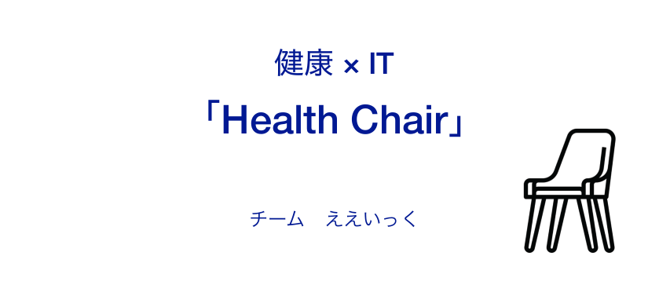
## 製品概要

### 紹介動画

### 背景
近年、テレワークやオンライン授業など、「**椅子に座る**」時間が増えてきています。椅子に座る時間が長くなると、運動不足による**肥満**、**足腰の痛み**、さらには**寿命への悪影響**など様々な問題を引き起こします。多くの企業、大学が継続したハイブリッド化を発表している昨今、自宅で椅子に座ることは避けて通ることはできません。

また、基本的な健康指標として体重がありますが、毎日体重計に乗って体重管理するのは面倒であり、新しい体重計を買ったのに全く使っていないという人も多いのではないでしょうか。実際、制作エンジニアの一人もダイエットしたいのに体重を毎日測るのが面倒で継続することができないという課題に直面しています。

これらの課題を解決する方法として、コロナ禍によって使用頻度が高くなった椅子を、ITによって「**健康器具**」に変えることを考えました。

### 製品説明
手持ちの椅子の足に荷重センサーを取り付けることで、座るだけで体重管理や座っている時間を測定できるデバイス「Health Chair」を開発しました。

### 特長
#### 1. 椅子に座るだけで健康管理できる！
#### 2. スマホ一つで簡単にデータ確認や設定が可能！
#### 3. すでに使っている椅子にも取り付け可能！

### 使用方法
1. 椅子の足に荷重センサーを取り付けておく
2. iOSアプリを起動して、椅子のBluetoothを検索する
3. 椅子のBluetoothを選択して接続する
4. 椅子に座ると、体重がリアルタイムで表示される
5. iOSアプリから、体重の推移や座っている時間を確認できる

### デバイス

メインボードにはESP32を使用しており、荷重センサの値をHX711というADコンバータから取得しています。
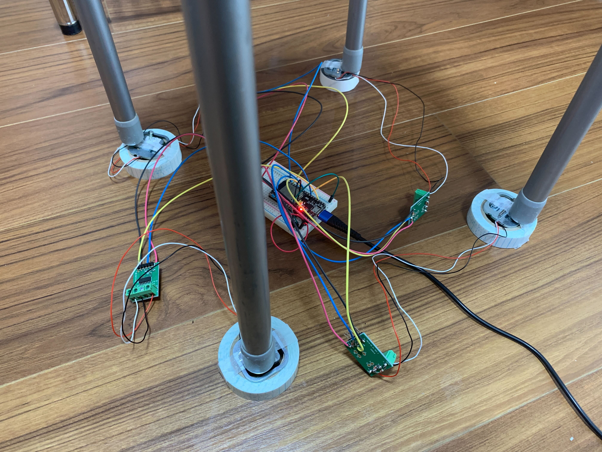
ESP32は各足の荷重センサの値をBLE経由でiOS、WiFi経由でサーバーに送信します。サーバーでは送られてきたデータを保存し、座っている時間等の統計を取ります。iOSではESP32から直接送信される荷重データを受け取り、リアルタイムで体重を表示します。また、サーバーから統計データを受信し、体重の推移や座っている時間をグラフで表示します。
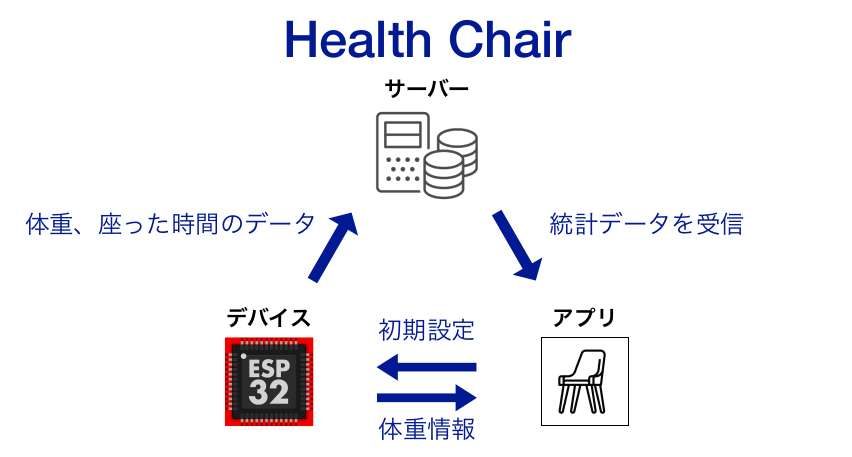

また、Award Dayに向け、デバイスのブラッシュアップを行いました
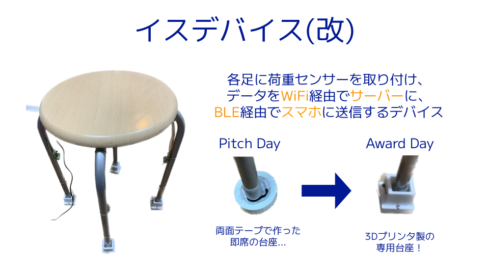

### メイン画面

|メイン画面1|メイン画面2|
|:---:|:---:|
|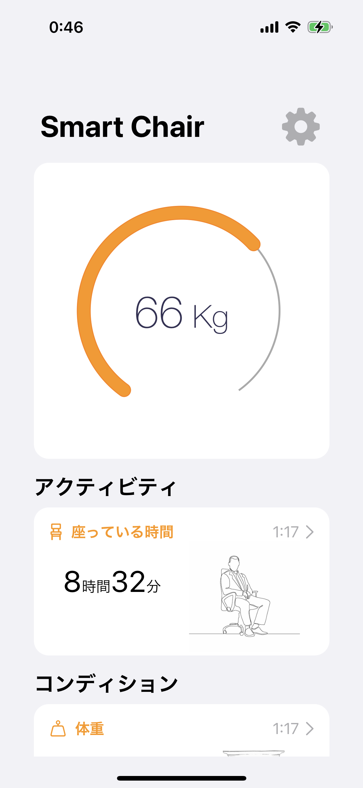|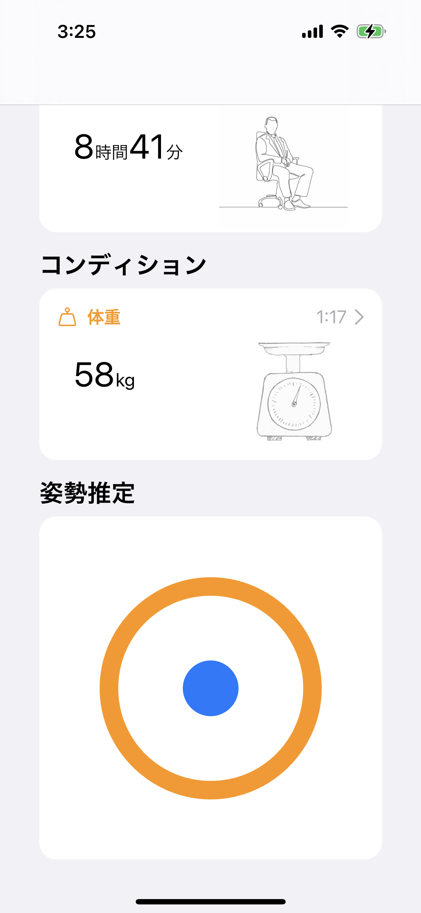|

### 設定画面

|設定画面|ペアリング画面|Wifi設定画面|
|:---:|:---:|:---:|
|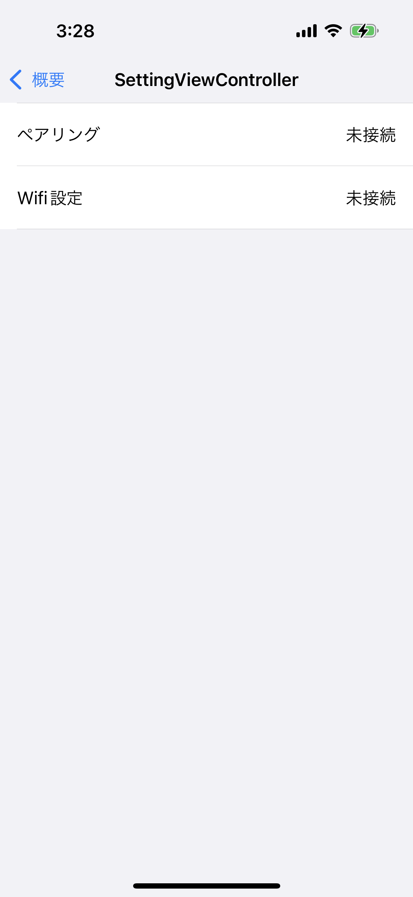|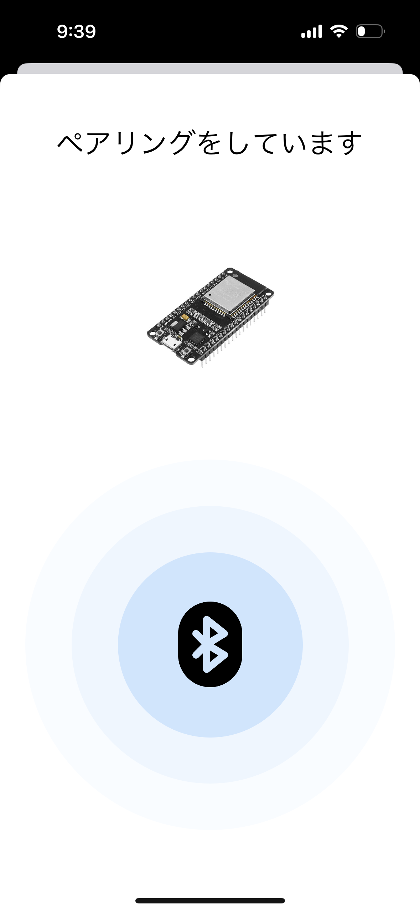|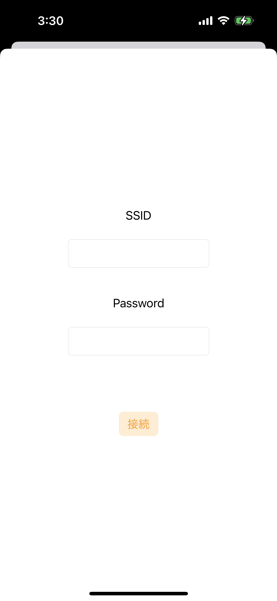|

### 記録確認画面

|座っていた時間|体重|
|:---:|:---:|
|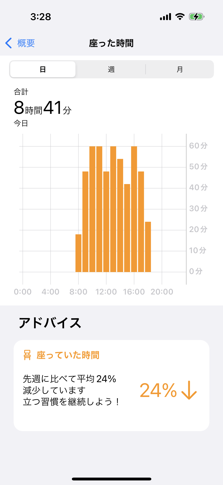|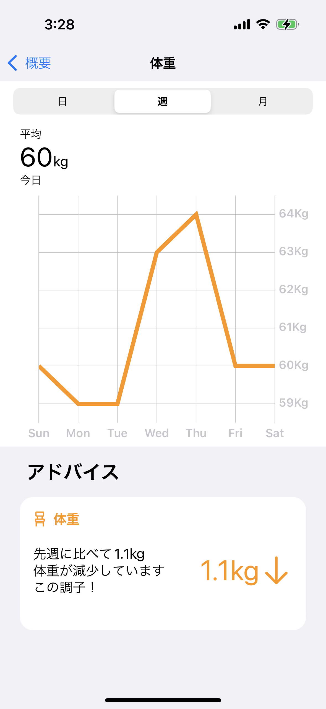|

### 解決出来ること
- 肥満予防や足腰の痛み予防
- ダイエットの継続
### 今後の展望
- 足をつけたままでの体重の測定(推定)
- どんな椅子にでも取り付けられるようにする
- 荷重測定モジュールを椅子のコロコロに埋め込むことで省スペース化
    - コロの回転による起電力で電源供給
- アプリに人格をもたせる
    - 「椅子に長く座っているので立って運動しましょう！」など
- イスに限らず、ベッドに取り付けることで寝たままで体重測定
    - 例えば要介護の方の体重測定が容易に

### 注力したこと
-  実現可能性(収益性、手軽さ)を高めるために多くの工夫をした
    - 椅子型デバイスではなく椅子の足に取り付けることで汎用性を高めた
    - スマホ一台で購入後設定を完結できることを想定し、Bluetoothで設定をできるようにした
    - 1台3000円程度と価格を安く抑えた

## 開発技術

### 構成図

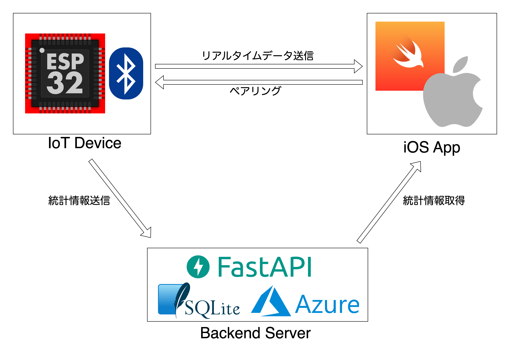
### 活用した技術
- クライアント
    - Swift
    - Core Bluetooth
    - Swift Concurrency
    - 描画ライブラリ(Charts, MBCircularProgressView)
    - Human Interface GuideLine(HIG)
    - Remote Push Notification
    - APNs
- バックエンド
    - Python
    - FastAPI
    - sqlite
    - SQLAlchemy
    - Docker
    - Poetry
    - CI (GitHub Actions)
- 組み込み
    - ESP32
    - Bluetooth Low Energy
    - httpClient

#### バックエンド・デバイスのファームウェアのソースはこちら
[https://github.com/jphacks/B_2216_1](https://github.com/jphacks/B_2216_1)

#### デバイス
* iOS(各種データ表示、設定)
* ESP32
* HX711(ひずみゲージセンサー)

### 独自技術
#### ハッカソンで開発した独自機能・技術
* 圧力センサーを利用して体重を計測するシステム
* フロントエンド
  * [Bluetooth接続部分(フロントエンド)](https://github.com/jphacks/B_2216/blob/c26b23d561683fe225e9d722c963b44387111fec/HealthChair/Manager/BluetoothManager.swift)
  * delegateやcompletionを活用したprotocol指向プログラミング

