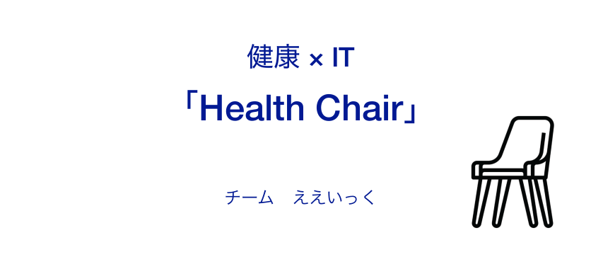
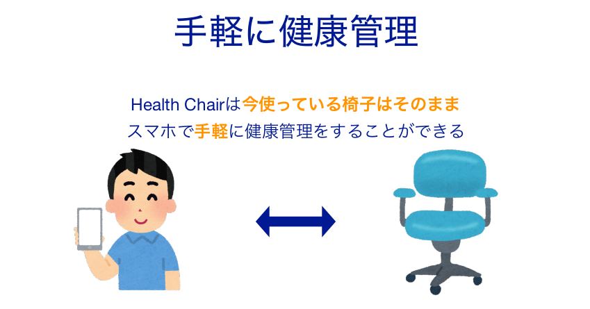
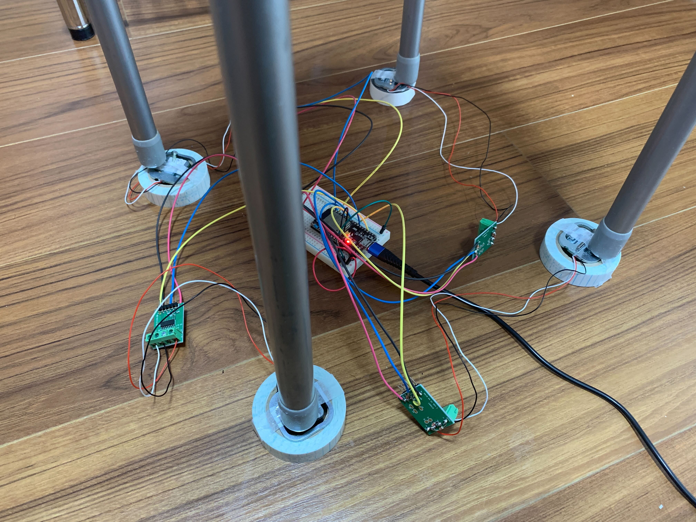
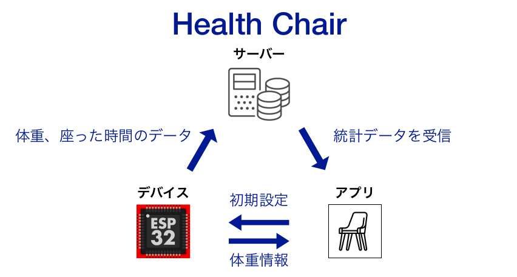

# Health Chair(ヘルスチェアー)

## 製品概要
### 背景(製品開発のきっかけ、課題等）
近年、テレワークやオンライン授業など、「**椅子に座る**」時間が増えてきています。椅子に座る時間が長くなると、運動不足による**肥満**、**足腰の痛み**、さらには**寿命への悪影響**など様々な問題を引き起こします。

また、基本的な健康指標として体重がありますが、毎日体重計に乗って体重管理するのは面倒であり、新しい体重計を買ったのに全く使っていないという人も多いのではないでしょうか。

これらの課題を解決する方法として、コロナ禍によって使用頻度が高くなった椅子を、ITによって「**健康器具**」に変えることを考えました。

### 製品説明（具体的な製品の説明）
手持ちの椅子の足に荷重センサーを取り付けることで、座るだけで体重管理や座っている時間を測定できるデバイス「health chair」を開発しました。

メインボードにはESP32を使用しており、荷重センサの値をHX711というADコンバータから取得しています。

ESP32は各足の荷重センサの値をBLE経由でiOS、WiFi経由でサーバーに送信します。サーバーでは送られてきたデータを保存し、座っている時間等の統計を取ります。iOSではESP32から直接送信される荷重データを受け取り、リアルタイムで体重を表示します。また、サーバーから統計データを受信し、体重の推移や座っている時間をグラフで表示します。

### 特長
#### 1. 椅子に座るだけで健康管理できる！

#### 2. スマホで簡単にデータ確認や設定が可能！
#### 3. すでに使っている椅子にも取り付け可能！

### 解決出来ること
### 今後の展望
- 足をつけたままでの体重の測定(推定)
- 長時間座っている場合に通知を送信
- 荷重分布で姿勢の測定
- 荷重測定モジュールを椅子のコロに埋め込むことで省スペース化
    - コロの回転による起電力で電源供給

### 注力したこと（こだわり等）
* 

## 開発技術
**何か図を入れる**
### 活用した技術
- フロントエンド
- バックエンド
    - Python
    - FastAPI
    - sqlite
    - SQLAlchemy
    - Docker
    - Poetry
- 組み込み
    - ESP32
    - Bluetooth Low Energy
    - httpClient

#### デバイス
* iOS(各種データ表示)
* ESP32
* HX711(ひずみゲージセンサー)

### 独自技術
#### ハッカソンで開発した独自機能・技術
* 独自で開発したものの内容をこちらに記載してください
* 特に力を入れた部分をファイルリンク、またはcommit_idを記載してください。

#### 製品に取り入れた研究内容（データ・ソフトウェアなど）（※アカデミック部門の場合のみ提出必須）
* 
* 
